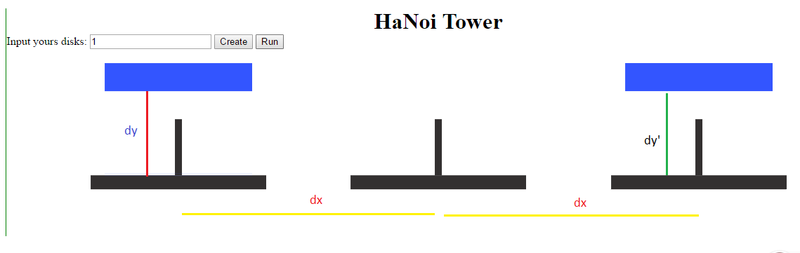
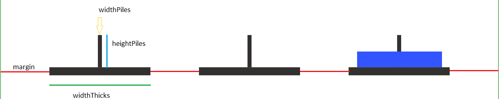

## Bài toán Dùng D3js để biểu diễn các bước chạy của thuật toán tháp Hà Nội (HaNoi Tower)
### Cách giải bài toán:
* Đặt tên các cọc là A, B, C (ở đây: A = Cọc Nguồn, B = Cọc Trung Gian, C = Cọc Đích).
* Gọi n là tổng số đĩa.
* đánh số đĩa từ 1 (nhỏ nhất, trên cùng) đến n (lớn nhất, dưới cùng).
#####  Để chuyển n đĩa từ cọc A sang cọc C thì cần:
1. chuyển n-1 đĩa từ A sang B. Chỉ còn lại đĩa n trên cọc A.
2. chuyển đĩa n từ A sang C.
3. chuyển n-1 đĩa từ B sang C cho chúng nằm trên đĩa n

#### Dùng thuật đệ quy để giải quyết bài toán này, tiến hành bước 1 và 3, áp dụng lại thuật giải cho n-1.
### Ví dụ cho 3 đĩa, các bước tiến hành:
1. chuyển đĩa 1 sang cọc C.
2. chuyển đĩa 2 sang cọc B.
3. chuyển đĩa 1 từ C sang B sao cho nó nằm lên 2.
##### Vậy ta hiện có 2 đĩa đã nằm trên cọc B, cọc C hiện thời trống
4. chuyển đĩa 3 sang cọc C
5. lặp lại 3 bước trên để chuyển 1 & 2 cho nằm lên 3.


### Cách tiếp cận bài toán:
   * Ta vẽ lần lượt các cột, các đĩa bằng d3js bằng cách tính toán tọa độ, tham khảo [jsfiddle.net](https://jsfiddle.net/nampb/tdebswnu/49/)
   * Bản chất của việc di chuyển đĩa là thay đổi tọa độ(x, y) của đĩa, trong d3js cung cấp 1 attribute ```transform="translate(new_x,new_y)"``` để làm việc này, đọc thêm [tại đây](https://www.dashingd3js.com/svg-group-element-and-d3js), xem [ví dụ này](https://jsfiddle.net/nampb/j47xg0w3/13/)
   * Mỗi đĩa rời khỏi tháp cũ sẽ phải bay lên 1 khoảng dy  và đáp xuống tháp mới 1 khoảng dy', sao cho đĩa phải đặt trên đáy hoặc bên trên 1 đĩa khác.
   * Chúng ta thấy tọa độ mới (new_x, new_y) của 1 đĩa khi di chuyển giữa các tháp sẽ phụ thuộc vào khoảng cách giữa các tháp (dx) và dy' phía trên,xem [ví dụ này](https://jsfiddle.net/nampb/jceuu4dz/3/).

       
   * Như vậy khi ta có 1 mảng data chứa đầy đủ thông tin thì bài toán đã được giải quyết

### Thông số để vẽ cột và đĩa:
```javascript
    const margin = 120
    const piles = {
        widthPiles: 10, // chiều rộng của cột
        heightPiles: 40, // chiều cao của cột
        widthThicks: ($('.disks').width() - 4 * margin) / 3, // chiều rộng của đế
        heightThicks: 20 // chiều cao của đế
    }

    const disk = {
        heightDisks: 40 // chiều cao của đĩa
    }
    const distancePiles = piles.widthThicks + margin // khoảng cách giữa các cột
    const cySvg = 100 //thẻ svg có 1 khoảng margin-top
```
### Cách vẽ cột và đĩa:
   * Vẽ đế : margin-left = margin-right = khoảng cách giữa các đế = margin
   * Vẽ cọc: khoảng cách cọc sẽ = số đĩa * chiều cao đĩa + chiều cao đĩa

    

### Lập trình theo hướng đối tượng:
   * Hướng đối tượng là  bản thân của mỗi chủ thể (đối tượng) phải có đầy đủ thông tin, hành động cụ thể để miêu tả rõ bản thân chủ thể đó.
   * Đối tượng cọc: tên cọc, hàm vẽ cọc.
   * Đối tượng đĩa: tên đĩa, hàm vẽ đĩa.
   * Đối tượng amination - miêu tả các bước di chuyển đĩa:  hàm trả về dữ liệu các bước di chuyển và hàm di chuyển đĩa.
   * Từ cách tiếp cận bài toán ta xây dựng được các class sau:
1. Class vẽ cọc
```javascript
    class Pile {
        constructor(namePile) {
            this.pile = namePile
        }

        drawPile(myDisks) {
          // code here
        }
    }
```

2. Class Disk
```javascript
    class Disk {
        constructor(nameDisk, signDisk) {
            this.nameDisk = nameDisk
            this.signDisk = signDisk // kí hiệu tên của đĩa
        }

        drawDisk(totalDisks) {
           // code here
        }
    }
```
3. Class tower

 ```javascript
    class Tower {
        constructor(nameTower) {
            this.nameTower = nameTower
        }

        tower() {
          // code here
        }
    }
 ```

4. Class amination

```javascript
    class GameEngine {
        constructor() {
            this.data = []
            this.count = 0
        }

        /*change distance when disks moved */
        getDistance(disk1, disk2) {
            // code here
        }

        /* move disk to other tower*/
        updateDisk(nameDisk, fromTower, toTower) {
           // code here
        }

        /* algorithms return data of Hanoi Tower */
        returnData(totalDisks, towerA, towerB, towerC) {
            if (totalDisks > 0) {
                this.returnData(totalDisks - 1, towerA, towerC, towerB)
                console.log(`Move disk ${totalDisks} from ${towerA.nameTower} to ${towerC.nameTower}`)
                this.data.push([arrDisks[totalDisks - 1], towerA, towerC])
                this.returnData(totalDisks - 1, towerB, towerA, towerC)
                this.count++
            }
            return this.data
        }

        /* move disk*/
        moveDisk(data, totalDisks) { // data sau khi được trả về sẽ được amination bằng hàm này
            // code here
        }
    }
```

### Nguồn tham khảo:
* Thuật toán [tháp hà nội](https://rosettacode.org/wiki/Towers_of_Hanoi#JavaScript).
* Learn D3js: [dashingd3js.com](https://www.dashingd3js.com/table-of-contents), [d3js.org](https://d3js.org/)